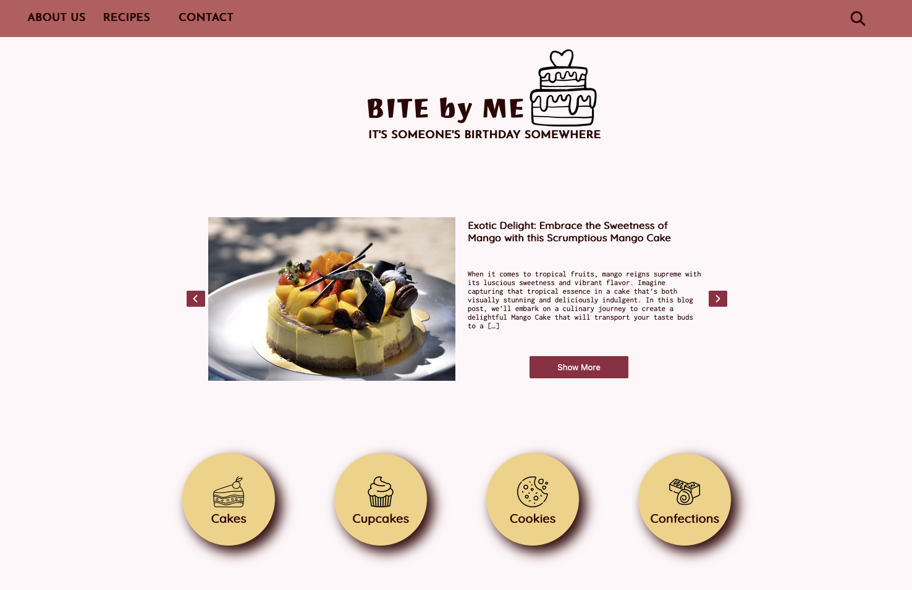

# Bite by Me

## It's someone's birthday somewhere



This is a blog website created for a school assignment. It is a baking blog website with different recipes hosted in WordPress.

### Notable features

- It contains a carousel on a home page,
- On a recpies-list page, it has a button to load another 10 posts,
- On a recipe page, it has a modal.

## Built with

This website is build with pure HTML, CSS and JavaScript. The recipes blogs are hosted on WordPress.

## Getting started

Clone this respository.

```
git clone git@github.com:zalacop/bite-by-me.git
```

You can run this application using your favourite server.

### Prerequsites

Set up a WordPress and save and publish some posts. Each post needs a title, text and an image, and if you'd like you can give it a tag.

You need to change `host` and set the correct tag id if you created one in `url.js`.
